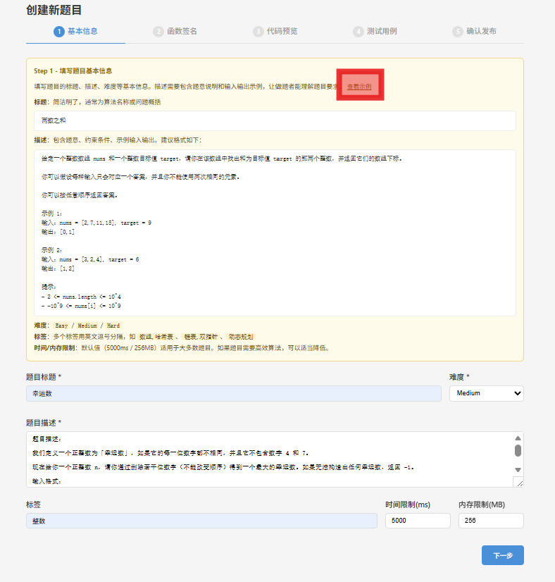
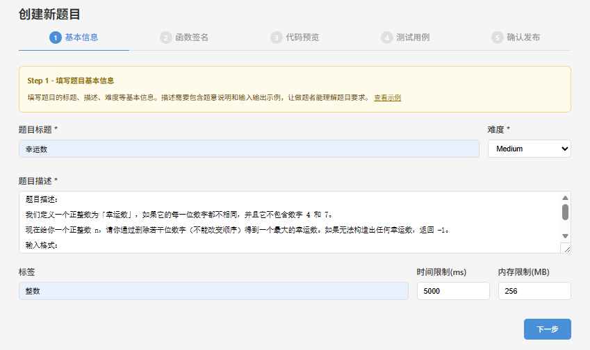
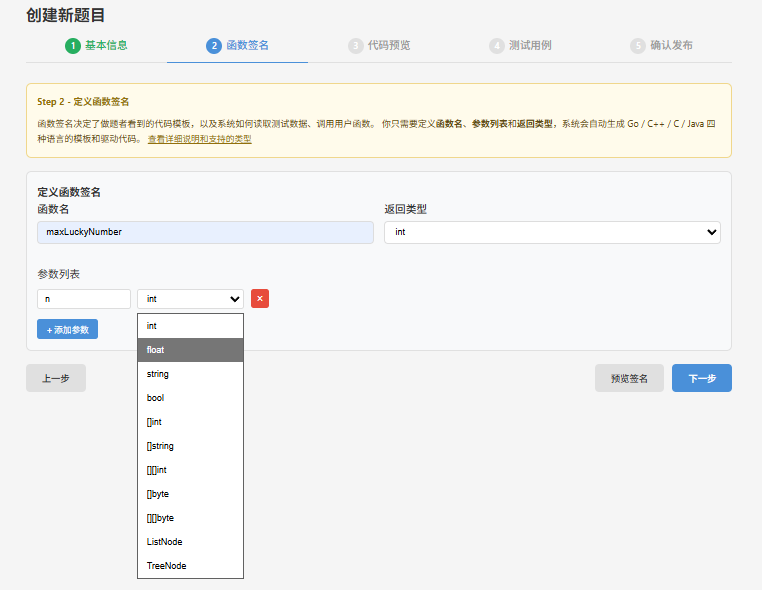
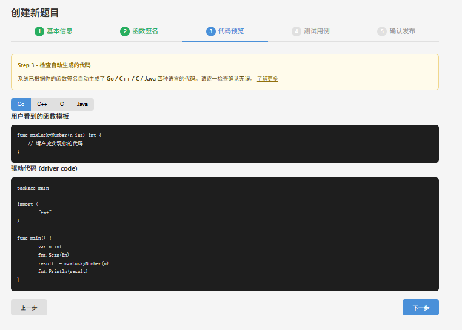
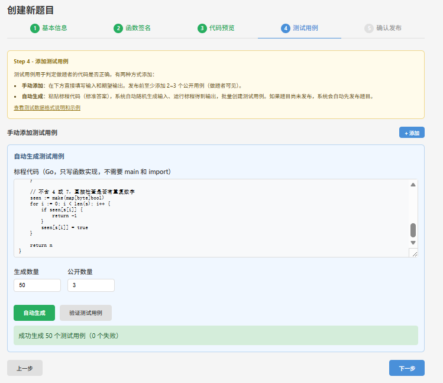
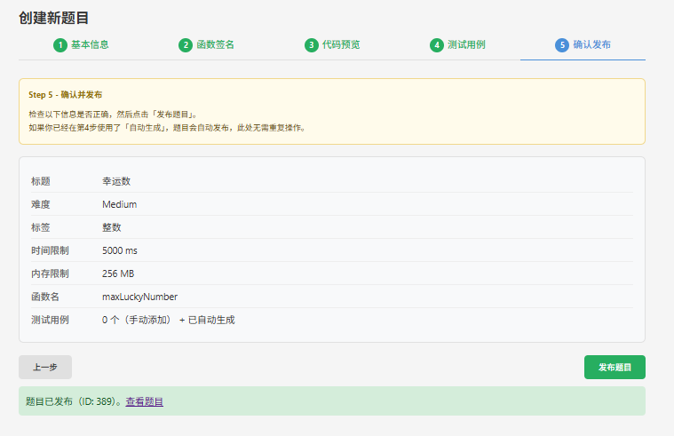
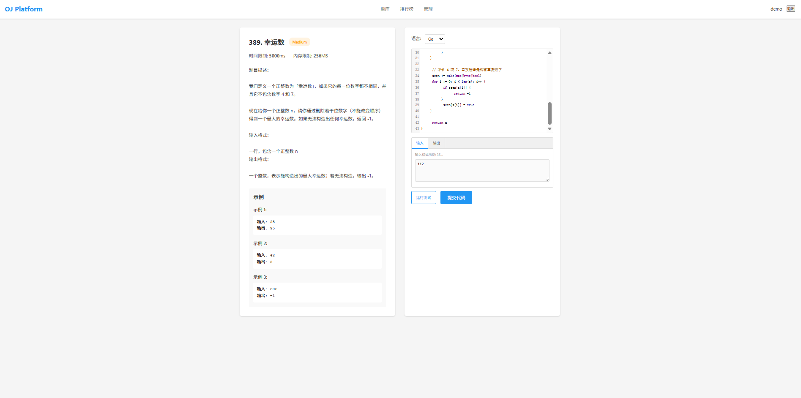

# OJ Platform

基于 Go + Gin + GORM + SQLite 的在线判题系统，支持多语言沙箱判题与可视化出题。

- 项目收集了hot100的经典力扣题单，并且使用每题50组数据（共5000组）对项目输入输出进行测试
- 项目支持创建题目的时候自动补全缺失的第三方依赖包（目前只对golang进行了简单测试）
- 项目使用青岛大学OJ库进行判题，精准度不错

## 创建题目流程

支持查看示例选项，帮助新手也可以出题



### 填写基本信息



### 主函数签名和出入参设计

支持定制化设计和预览功能



### 代码效果预览

支持多语言（目前只测试了golang）



### 创建测试样例

支持一键创建测试样例



### 发布题目

支持快速跳转快速测试



### 输入输出测试功能



经过多次输入输出预期结果的正误测试

## 快速开始

```bash
git clone <repo-url>
cd oj-platform
./deploy.sh
```

自动完成：检查依赖 -> 编译 -> 建表 -> 导入题库 -> 启动服务。部署完成后终端会显示访问地址。

**环境要求**：Go 1.21+（必须），GCC/G++、JDK 17+、`/usr/bin/time`、SQLite3（可选）

**管理命令**：

```bash
./deploy.sh stop         # 停止
./deploy.sh restart      # 重启
./deploy.sh reset        # 重置数据库
./deploy.sh status       # 查看状态
```

也可以用 `make build`、`make run`、`make deploy`、`make docker-up`。

**配置**：首次部署自动从 `config.example.yaml` 生成 `config.yaml`，可改端口、JWT 密钥等。

## 功能

**做题**：100 道 LeetCode Hot 100 预置题目 + 5000 组测试用例，支持 Go/C/C++/Java 提交，沙箱隔离执行，实时判题和排行榜。

**出题**：5 步可视化向导（描述 -> 函数签名 -> 代码预览 -> 测试用例 -> 发布），定义签名后自动生成 4 种语言的模板和驱动代码，粘贴标程即可批量生成并验证测试用例。

**自动 import**：Go 代码只需写函数体，平台自动补全 19 个常用标准库（`fmt`、`strconv`、`strings`、`sort`、`math`、`math/big`、`math/bits`、`math/rand`、`bufio`、`bytes`、`os`、`io`、`errors`、`regexp`、`sync`、`unicode`、`unicode/utf8`、`container/heap`、`container/list`）。

**支持的参数类型**（11 种）：`int`、`float`、`string`、`bool`、`[]int`、`[]string`、`[][]int`、`[]byte`、`[][]byte`、`ListNode`、`TreeNode`

## 目录结构

```
oj-platform/
├── cmd/server/              # 主程序入口
├── internal/
│   ├── codegen/             # 多语言代码生成器（Go/C/C++/Java）
│   ├── handlers/            # HTTP 处理器（判题、出题、用户、排行榜）
│   ├── judge/               # 判题引擎（编译 + 沙箱 + 自动 import）
│   ├── models/              # 数据模型
│   ├── repository/          # 数据访问层
│   ├── routes/              # 路由
│   ├── middleware/          # CORS, JWT
│   ├── database/            # 数据库初始化
│   ├── queue/               # 判题队列
│   └── services/            # 业务层
├── web/                     # 前端（登录、题目、做题、出题、管理、排行榜）
├── tools/
│   ├── testdata/            # 预置题库 SQL + 数据生成脚本
│   ├── docker/              # Dockerfile + docker-compose.yml
│   └── ai-helper/           # AI 解题助手
├── docs/                    # 项目文档（API、架构、部署、技术指南）
├── migrations/              # 数据库迁移
├── pkg/                     # 公共包（config, response）
├── deploy.sh                # 一键部署
├── Makefile
└── config.example.yaml      # 配置模板
```

## API

| 方法 | 路径 | 说明 | 认证 |
|------|------|------|------|
| POST | `/api/v1/register` | 注册 | - |
| POST | `/api/v1/login` | 登录 | - |
| GET | `/api/v1/problems` | 题目列表 | - |
| GET | `/api/v1/problems/:id` | 题目详情 | - |
| POST | `/api/v1/submit` | 提交代码 | Y |
| POST | `/api/v1/test` | 运行测试 | Y |
| GET | `/api/v1/leaderboard` | 排行榜 | - |
| POST | `/api/v1/admin/problems` | 创建题目 | Y |
| PUT | `/api/v1/admin/problems/:id` | 编辑题目 | Y |
| DELETE | `/api/v1/admin/problems/:id` | 删除题目 | Y |
| POST | `/api/v1/admin/problems/:id/generate-testcases` | 自动生成测试 | Y |
| POST | `/api/v1/admin/problems/:id/validate-testcases` | 验证测试 | Y |

完整 API 文档见 `docs/API.md`。

## License

MIT
